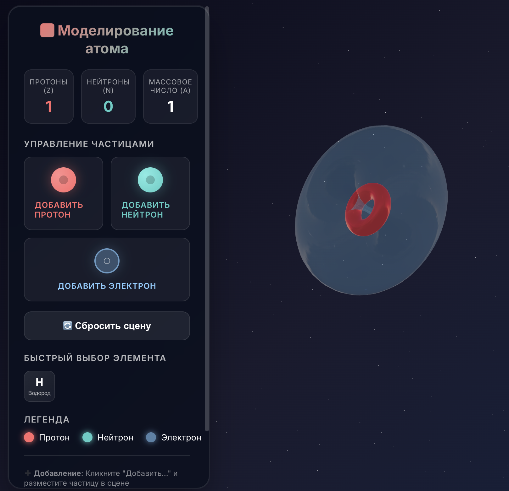

# ⚛️ 3D Моделирование Атома

Интерактивное веб-приложение для визуализации и моделирования строения атомов в 3D пространстве. Проект позволяет наглядно изучать структуру атома, манипулируя протонами, нейтронами и электронными облаками.



## ✨ Возможности

### Частицы
*   🔴 **Протон**: Частица ядра атома в форме тора.
*   🔵 **Нейтрон**: Нейтральная частица ядра.
*   ☁️ **Электрон**: Представлен в виде объемного полупрозрачного "облака" (большой тор), которое окутывает ядро.

### Интерактивность
*   **Свободное размещение**: Добавляйте частицы в любую точку пространства.
*   **Привязка к сетке (Snapping)**: Частицы при перемещении "прилипают" к координатной сетке с шагом 0.5 для удобного выравнивания.
*   **Вращение частиц**: Возможность вращать каждую частицу вокруг своей оси с шагом 15° (ПКМ + Drag).
*   **Управление камерой**: Полный контроль над обзором (вращение, зум).

### Пресеты
*   **Водород (H)**: Быстрое создание атома Водорода, где электронное облако идеально центрировано вокруг единственного протона.

## 🛠 Технологический стек

*   [React](https://reactjs.org/)
*   [Vite](https://vitejs.dev/)
*   [Three.js](https://threejs.org/)
*   [@react-three/fiber](https://docs.pmnd.rs/react-three-fiber) — декларативный Three.js для React
*   [@react-three/drei](https://github.com/pmndrs/drei) — коллекция полезных хелперов

## 🚀 Установка и запуск

1.  **Клонируйте репозиторий:**
    ```bash
    git clone <repository-url>
    cd 3dParticles
    ```

2.  **Установите зависимости:**
    ```bash
    npm install
    ```

3.  **Запустите сервер разработки:**
    ```bash
    npm run dev
    ```

4.  **Откройте приложение:**
    Перейдите по ссылке `http://localhost:5173/` в вашем браузере.

## 🎮 Управление

| Клавиша / Действие | Функция |
|-------------------|---------|
| **ЛКМ + Drag** (на фоне) | Вращение камеры вокруг сцены |
| **Колесо мыши** | Приближение / Удаление (Zoom) |
| **Клик "Добавить..."** | Выбор частицы для добавления (Протон/Нейтрон/Электрон) |
| **Клик в пространстве** | Размещение выбранной частицы |
| **Esc** | Отмена режима добавления |
| **ЛКМ + Drag** (на частице) | Перемещение частицы (Snap 0.5) |
| **ПКМ + Drag** (на частице) | Вращение частицы (Snap 15°) |

---
*Проект создан для образовательных целей и визуализации микромира.*
